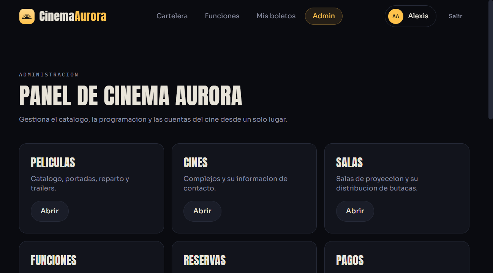

# Cinema Aurora — Frontend

Cliente web de **Cinema Aurora**, un sistema de venta de boletos de cine: catálogo de películas,
selección de función, mapa de butacas en tiempo real, pago y boleto con código QR, más un panel de
administración completo para operar el negocio (películas, cines, salas, funciones, reservas, pagos
y usuarios).

Este repositorio contiene **solo el frontend** (React + TypeScript). Consume la API REST de Cinema
Aurora, un backend Django separado que no forma parte de este repositorio — ver
[API consumida](#api-consumida) para el contrato completo.


<p align="center">
  
  
</p>
<p align="center">
  
</p>

> **Nota de precisión:** el badge de TypeScript muestra la serie mayor (5) por legibilidad; la
> versión exacta fijada en `package.json` es `~6.0.2`. Ver [Tecnologías](#tecnologías) para las
> versiones literales de cada dependencia.

---

## Contenido

- [Descripción](#descripción)
- [Características](#características)
- [Tecnologías](#tecnologías)
- [Arquitectura](#arquitectura)
- [Flujo de funcionamiento](#flujo-de-funcionamiento)
- [Requisitos previos](#requisitos-previos)
- [Instalación y configuración local](#instalación-y-configuración-local)
- [Variables de entorno](#variables-de-entorno)
- [Ejecutar el proyecto](#ejecutar-el-proyecto)
- [Estructura de carpetas](#estructura-de-carpetas)
- [API consumida](#api-consumida)
- [Pruebas](#pruebas)
- [Despliegue con Docker](#despliegue-con-docker)
- [Autores y licencia](#autores-y-licencia)

---

## Descripción

Comprar un boleto de cine suele significar navegar carteleras confusas y mapas de asientos que no
reflejan la disponibilidad real. Cinema Aurora resuelve esto del lado del cliente con un flujo
directo — catálogo, función, butaca, pago, boleto — y una interfaz con identidad visual propia (sala
de proyección oscura, acento ámbar de proyector) en vez de un theme genérico de UI kit.

Este frontend es una **SPA** construida con React 19, TypeScript y Vite, que habla con la API REST de
Cinema Aurora vía `axios` + `@tanstack/react-query`, maneja sesión con JWT (access + refresh
automático) y expone tanto el flujo de cliente como un panel de administración protegido por rol.

## Características

Verificadas directamente en el código de este repositorio (`src/`):

- **Catálogo y ficha de película** con póster, sinopsis, reparto con foto y tráiler embebido
  (`src/features/movies/`).
- **Selector de funciones y mapa de butacas** interactivo con tipos de asiento y estado en vivo
  (`src/features/showtimes/`, `src/features/seatMap/`).
- **Flujo de reserva y pago**, con cuenta regresiva del hold temporal (`useCountdown`) y boleto final
  con código QR generado en cliente (`qrcode`) (`src/features/reservations/`, `src/features/payments/`).
- **Autenticación JWT** con refresh automático ante `401` y cierre de sesión global vía evento
  (`src/lib/axios.ts`, `src/features/auth/`).
- **Rutas protegidas** por sesión (`RutaPrivada`) y por rol de administrador (`RutaAdmin` +
  `AdminLayout`, anidadas bajo `/admin`).
- **Panel de administración** con seis áreas — películas, cines, salas, funciones, reservas, pagos y
  usuarios — cada una con listado, alta/edición y las confirmaciones correspondientes
  (`src/features/admin/`).
- **Sistema de diseño propio** en Tailwind 4 (tokens de color/tipografía en `src/styles/index.css`),
  sin depender de un UI kit de terceros.
- **Estado de servidor con TanStack Query** (cache, invalidación, `keepPreviousData` en listados
  paginados) y **estado de cliente con Zustand** (sesión, mapa de asientos en curso).

## Tecnologías

Versiones exactas tomadas de `package.json`:

| Categoría | Paquete | Versión |
|---|---|---|
| Framework | `react` / `react-dom` | ^19.2.7 |
| Lenguaje | `typescript` | ~6.0.2 |
| Build | `vite` | ^8.1.1 |
| Estilos | `tailwindcss` + `@tailwindcss/vite` | ^4.3.3 |
| Enrutamiento | `react-router-dom` | ^7.18.1 |
| Datos de servidor | `@tanstack/react-query` | ^5.101.4 |
| Estado de cliente | `zustand` | ^5.0.14 |
| HTTP | `axios` | ^1.18.1 |
| Animación | `framer-motion` | ^12.42.2 |
| Código QR | `qrcode` | ^1.5.4 |
| Lint | `oxlint` | ^1.71.0 |

## Arquitectura

Organización por **feature folders**: cada carpeta bajo `src/features/` agrupa sus propias páginas,
componentes y su archivo `api.ts` (llamadas a la API específicas de esa función), en vez de separar
por tipo de archivo. `src/features/admin/` replica la misma idea para cada área del panel.

```
Usuario → Página (feature) → api.ts (axios) → Backend Django REST
                ↕
        TanStack Query (cache) / Zustand (sesión, mapa de asientos)
```

- **`src/lib/axios.ts`**: instancia única de `axios` con interceptor de request (agrega el JWT) y de
  response (si el access token expiró, pide uno nuevo con el refresh token; si tampoco sirve, dispara
  un evento global `cine:sesion-expirada` que cualquier layout puede escuchar para cerrar sesión).
- **`src/app/router.tsx`**: define todas las rutas con `react-router-dom` v7 (`createBrowserRouter`),
  incluida la rama `/admin` anidada bajo `AdminLayout` + `RutaAdmin`.
- **`src/types/index.ts`**: tipos TypeScript que reflejan las respuestas reales de la API (un cambio
  de forma en el backend se detecta en tiempo de compilación aquí).
- **Alias de import `@/`** apunta a `src/` (configurado en `vite.config.ts` y `tsconfig.app.json`).

## Flujo de funcionamiento

**Cliente:**

```
Cartelera (/) → Ficha de película (/peliculas/:id) → Elegir función
   → Mapa de butacas (/funciones/:id/asientos) → Resumen de reserva (/reservas/:id)
   → Pago (/reservas/:id/pago) → Boleto con QR (/reservas/:id/boleto)
```

El historial de reservas del cliente vive en `/mis-reservas`.

**Administración** (requiere rol `admin`, protegido por `RutaAdmin`):

```
/admin (panel) → Películas · Cines · Salas · Funciones · Reservas · Pagos · Usuarios
```

## Requisitos previos

- **Node.js 22** (versión usada en el `Dockerfile`; no hay `.nvmrc` en el repo, así que se documenta
  la que efectivamente se usa para el build de producción).
- **npm** (el repo trae `package-lock.json`).
- La **API de Cinema Aurora corriendo y accesible** — este frontend no funciona de forma aislada. Sin
  ese backend, las pantallas cargan pero ninguna petición de datos tendrá éxito.

## Instalación y configuración local

```bash
git clone <url-de-este-repositorio>
cd frontend_cine
npm install
cp .env.example .env
```

Edita `.env` para apuntar a tu backend:

```
VITE_API_URL=http://127.0.0.1:8000/api/v1
```

## Variables de entorno

Todas las variables reales están en `.env.example` — no hay secretos en este proyecto porque el
frontend solo necesita saber **dónde** está la API; la autenticación la maneja el usuario final con
su propia cuenta.

| Variable | Ejemplo | Descripción |
|---|---|---|
| `VITE_API_URL` | `http://127.0.0.1:8000/api/v1` | URL base de la API de Cinema Aurora que consume este frontend. |

## Ejecutar el proyecto

```bash
npm run dev       # servidor de desarrollo (http://localhost:5173)
npm run build     # type-check (tsc -b) + build de producción a dist/
npm run preview   # sirve el build de dist/ localmente
npm run lint      # oxlint
```

## Estructura de carpetas

```
frontend_cine/
├── public/
│   └── butaca.svg              # favicon
├── src/
│   ├── app/                    # router.tsx, RutaPrivada, RutaAdmin, AdminLayout
│   ├── components/             # Button, Field, Modal, Toast, Badge, Logo, Countdown, States...
│   ├── features/
│   │   ├── admin/              # movies, theaters, showtimes, reservations, payments, users
│   │   ├── auth/                # login, registro, store de sesión
│   │   ├── movies/              # catálogo y ficha de película
│   │   ├── payments/            # pago y boleto con QR
│   │   ├── reservations/        # resumen e historial de reservas
│   │   ├── seatMap/              # mapa de butacas interactivo
│   │   └── showtimes/            # listado y selector de funciones
│   ├── hooks/                    # useAuth, useCountdown, useMediaQuery
│   ├── layouts/                  # MainLayout, AuthLayout
│   ├── lib/                      # axios.ts, queryClient.ts, format.ts, cn.ts
│   ├── types/                    # tipos compartidos (contrato con la API)
│   └── styles/                   # index.css — tokens de diseño Tailwind 4
├── Dockerfile
├── nginx.conf
├── vite.config.ts
├── tsconfig.json / tsconfig.app.json / tsconfig.node.json
├── .env.example
└── package.json
```

## API consumida

Este frontend asume la API REST de Cinema Aurora (Django REST Framework) bajo `VITE_API_URL`. No se
incluye aquí la implementación del backend — solo el contrato que este cliente usa:

| Recurso | Endpoints |
|---|---|
| Auth | `POST /auth/register`, `POST /auth/login`, `POST /auth/refresh`, `GET\|PATCH /auth/me` |
| Catálogo | `GET /movies`, `GET /movies/{id}`, `GET /genres` |
| Funciones | `GET /showtimes`, `GET /showtimes/{id}`, `GET /showtimes/{id}/seats`, `GET /cinemas` |
| Reservas | `POST /reservations`, `GET /reservations/{id}`, `DELETE /reservations/{id}`, `GET /users/me/reservations` |
| Pagos | `POST /reservations/{id}/payment` (header `Idempotency-Key`), `GET /reservations/{id}/ticket` |
| Admin | `/admin/movies`, `/admin/cinemas`, `/admin/rooms`, `/admin/showtimes`, `/admin/reservations`, `/admin/payments`, `/admin/users` (todos protegidos por rol) |

Los errores de la API llegan con una forma consistente que el cliente interpreta en
`src/lib/axios.ts`:

```json
{ "error": { "codigo": "asiento_no_disponible", "mensaje": "Estos asientos ya fueron tomados: I5, I6" } }
```

## Pruebas

**No hay pruebas automatizadas configuradas en este repositorio** (no existe `vitest`, `jest`,
`playwright` ni carpeta `__tests__`/`*.test.*` en `src/`). El único chequeo automático disponible hoy
es estático: `npm run build` (type-check con `tsc -b`) y `npm run lint` (`oxlint`). Si se agregan
pruebas de componentes o end-to-end más adelante, esta sección debe actualizarse.

## Despliegue con Docker

```bash
docker build -t cinema-aurora-frontend --build-arg VITE_API_URL=/api/v1 .
docker run -p 8080:80 cinema-aurora-frontend
```

La imagen usa un build multi-stage (`node:22-alpine` → `nginx:1.27-alpine`) y sirve el build estático
de Vite. El `nginx.conf` incluido asume que existe un host llamado `backend` en la misma red de
Docker escuchando en el puerto `8000` (así lo espera `docker-compose.yml` del proyecto completo) y le
hace *proxy* de `/api/`, `/admin/` y `/static/`. Si corres esta imagen fuera de esa red, ajusta esos
`proxy_pass` en `nginx.conf` a la URL real de tu backend antes de construir la imagen.

## Autores y licencia

- **Autor:** _(pendiente — completar con nombre/usuario de GitHub antes de publicar)_.
- **Licencia:** este repositorio no incluye un archivo `LICENSE`. _(pendiente — definir MIT,
  propietaria u otra antes de publicar)_.
